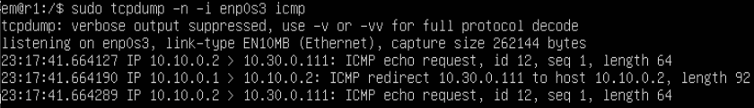

# Сети в Linux

## Содержание

1. [Инструмент ipcalc](#1-инструмент-ipcalc)
2. [Статическая маршрутизация между двумя машинами](#2-статическая-маршрутизация-между-двумя-машинами)
3. [Утилита iperf3](#3-утилита-iperf3)
4. [Сетевой экран](#4-сетевой-экран)
5. [Статическая маршрутизация сети](#5-статическая-маршрутизация-сети)
6. [Динамическая настройка IP с помощью DHCP](#6-динамическая-настройка-ip-с-помощью-dhcp)
7. [NAT](#7-nat)
8. [Допополнительно. Знакомство с SSH Tunnels](#8-дополнительно-знакомство-с-ssh-tunnels)

## 1 Инструмент ipcalc
### 1.1 Сети и маски
* ipcalc — утилита, которая может выполнять простые манипуляции с адресами IPv4.
1. Вычислим адрес сети 192.167.38.54/13 с помощью команды ipcalc

* Как видно на скриншоте, адрес сети 192.160.0.0
2. Перевод маски 255.255.255.0 в префиксную и двоичную запись

* Запись маски в префиксной форме /24
* Запись маски в двоичной системе 11111111.11111111.11111111.00000000
3. Перевод маски /15 в обычную и двоичную запись

* Запись маски в обычной форме 255.254.0.0
* Запись маски в двоичной системе 11111111.11111110.00000000.00000000
4. Перевод маски 11111111.11111111.11111111.11110000 в обычную и префиксную запись
* Запись маски в обычной форме 255.255.255.240
* Запись маски в двоичной системе /28
5.  Минимальный и максимальный хост в сети 12.167.38.4 при маске /8

* Минимальный хост 12.0.0.1
* Максимальный хост 12.255.255.254
6. Минимальный и максимальный хост в сети 12.167.38.4 при маске 11111111.11111111.00000000.00000000

* Минимальный хост 12.167.0.1
* Максимальный хост 12.167.255.254
7. Минимальный и максимальный хост в сети 12.167.38.4 при маске 255.255.254.0

* Минимальный хост 12.167.38.1
* Максимальный хост 12.167.39.254

8. Минимальный и максимальный хост в сети 12.167.38.4 при маске /4

* Минимальный хост 0.0.0.1
* Максимальный хост 15.255.255.254
### 1.2 localhost
* Можно ли обратиться к приложению, работающему на localhost, со следующими IP: 194.34.23.100, 127.0.0.2, 127.1.0.1, 128.0.0.1?
* ip адреса 127.0.0.0 — 127.255.255.255 зарезервированы за localhost, то есть к приложению можно обратиться с адресами 127.0.0.2 и 127.1.0.1
### 1.3 Диапазоны и сегменты сетей
1. Какие из перечисленных IP можно использовать в качестве публичного, а какие только в качестве частных: 10.0.0.45, 134.43.0.2, 192.168.4.2, 172.20.250.4, 172.0.2.1, 192.172.0.1, 172.68.0.2, 172.16.255.255, 10.10.10.10, 192.169.168.1?
* В качестве частных ip можно использовать 10.0.0.45, 10.10.10.10, 172.20.250.4, 172.16.255.255, 192.168.4.2
* Остальные адреса можно использовать в качестве публичных
2. Какие из перечисленных IP адресов шлюза возможны у сети 10.10.0.0/18: 10.0.0.1, 10.10.0.2, 10.10.10.10, 10.10.100.1, 10.10.1.255?

* Минимальный хост 10.10.0.1
* Максимальный хост 10.10.63.254
* Отсюда из перечисленных IP адресов шлюза возможны 10.10.0.2, 10.10.10.10, 10.10.1.255
## 2 Статическая маршрутизация между двумя машинами
1. Вывод команды ip a для ws1

2. Вывод команды ip a для ws2

3. Изменение ip адреса ws1

4. Изменение ip адреса ws2

5. netplan apply для ws1

6. netplan apply для ws2

7. Для каждой ВМ меняем тип подключения на внутреннее
8. На ws1 командой ip r add 172.24.116.8/32 dev enp0s3 добавляем соединение с ws2
9. На ws2 командой ip r add 192.168.100.10/32 dev enp0s3 добавляем соединение с ws1
10. Пингуем ip на каждой ВМ

11. Изменение ip адреса ws1 с помощью yaml файла

12. Изменение ip адреса ws2 с помощью yaml файла

13. netplan apply для каждой ВМ
14. Пингуем ip на каждой ВМ

## 3 Утилита iperf3
### 3.1 Скорость соединения
* 8 Mbps = 1 MB/s, 100 MB/s = 800000 Kbps, 1 Gbps = 1000 Mbps
### 3.2 Утилита iperf3
* iperf3 — это программа для измерения пропускной способности сети в реальном времени.
1. Выполняем команду iperf3 -s на ws2. Теперь ws2 является сервером

2. Выполняем команду iperf3 -c 172.24.116.8 на ws1. Теперь ws1 является клиентом

## 4 Сетевой экран
### 4.1 Утилита iptables
* iptables - это утилита в системах Linux, предназначенная для настройки фильтрации пакетов и управления правилами брандмауэра в ядре Linux
1. Создаём файл /etc/firewall.sh на ws1 ws2 командой touch
2. firewall.sh для ws1 и его запуск

3. firewall.sh для ws2 и его запуск

* Разница в стратегиях заключается в порядке добавления правил, что влияет на последовательность их применения к сетевому трафику.
### 4.2 Утилита nmap
* nmap предоставляет информацию о компьютерах в сети, определяет активные хосты, открытые порты, службы и т.д.
1. Теперь пропингуем ip

* Как видно на скриншоте, 192.168.100.10 не пингуется

2. Вызов команды nmap для 192.168.100.10

## 5 Статическая маршрутизация-сети
### 5.1 Настройка адресов машин 
1. Настраиваем адреса вм

* ws11

* r1

* r2

* ws21

* ws22

2. На каждой вм перезапускаем сервис сети, выполняем команду ip -4 a

* ws11

* r1

* r2

* ws21

* ws22

3. Пингуем ws22 с ws21

4. Пингуем r1 с ws11

### 5.2 Включение переадресации IP-адресов
1. Для включения переадресации IP, выполним команду на роутерах sysctl -w net.ipv4.ip_forward=1

2. Чтобы переадресация ip осталась после перезагрузки, нужно внести изменения в /etc/sysctl.conf

* r1

* r2

### 5.3 Установка маршрута по-умолчанию
1. Добавляем шлюзы в yaml файлы на ws11, ws21, ws22

* ws11

* ws21

* ws22

2. Вызов команды ip r для ws11, ws21, ws22

* ws11

* ws21

* ws22

* На скриншотах видны маршруты по-умолчанию

3. На r2 выполняем команду tcpdump -tn -i enp0s3 и пингуем r2 с ws11

* Как видно на скриншотах, пинг доходит до r2 с ws11
### 5.4 Добавление статических маршрутов
1. Добавляем статические маршруты в yaml файлы на r1 и r2

* r1

* ip r на r1

* r2

* ip r на r2

2. Запустим команды на ws11 ip r list 10.10.0.0/18 и ip r list 0.0.0.0/0

* Когда устройство находится в той же локальной сети, что и отправитель (в данном случае, 10.10.0.2), не требуется маршрутизация. Вместо этого, трафик напрямую передается на соответствующий интерфейс. \
То есть вместо использования маршрута по умолчанию, трафик для сети 10.10.0.0/18 обрабатывается непосредственно через интерфейс enp0s3 с адресом 10.10.0.2.
### 5.5 Построение списка маршрутизации
1. На r1 запускаем команду дампа tcpdump -tnv -i enp0s3
2. На ws11 выполняем команду traceroute 10.20.0.10

* Вывод команды tcpdump -tnv -i enp0s3 на r1 при выполнении traceroute 10.20.0.10 на ws11

* Таблица маршрутизации

* Как работает traceroute: ws11 отправляет UDP-пакет к ws21 с TTL(Time-To-Live)=1. \
Первый хоп: Пакет доходит до r1 (10.10.0.1). TTL уменьшается до 0, и r1 отправляет ICMP "Time Exceeded" сообщение. Traceroute записывает r1 как первый хоп. Ws11 отправляет UDP-пакет к ws21 с TTL=2. \
Второй хоп: Пакет доходит до r1 (10.100.0.12). TTL уменьшается до 0, и r1 отправляет ICMP "Time Exceeded" сообщение. Traceroute записывает r2 как второй хоп. Ws11 отправляет UDP-пакет к ws21 с TTL=3. \
Третий хоп: Пакет доходит до ws21 (10.20.0.10). TTL уменьшается до 0, и ws21 отправляет ICMP "Time Exceeded" сообщение. \
traceroute записывает ws21 как третий хоп.
### 5.6 Использование протокола ICMP при маршрутизации
1. Запускаем на r1 перехват сетевого трафика через enp0s3 командой tcpdump -n -i enp0s3 icmp
2. Пингуем с ws11 несуществующий ip

* Вывод tcpdump -n -i enp0s3 icmp на r1 при выполнении команды ping на ws11

## 6 Динамическая настройка ip с помощью dhcp
* DHCP — это протокол прикладного уровня модели TCP/IP, используемый для назначения IP-адреса клиенту. Каждому клиенту, то есть компьютеру в локальной сети, можно вручную назначить IP-адрес. Но в больших сетях это очень трудоемко и более того, чем больше локальная сеть, тем выше вероятность ошибки конфигурации. Вот почему протокол DHCP был создан для автоматизации назначения IP.
1. Редактируем файл etc/dhcp/dhcpd.conf на r2: указываем адрес маршрутизатора по умолчанию, DNS-сервер и адрес внутренней сети.

2. В файле resolv.conf прописываем nameserver 8.8.8.8

3. Перезапускаем службу dhcp на r2 командой systemctl restart isc-dhcp-server
4. Перезапускаем ws21
5. Вывод команды ip a на ws21

6. Пингуем ws22 с ws21

7. Редактируем yaml файл на ws11: указываем MAC адрес. Также нужно поменять MAC адрес в настройках ВМ.

8. Редактируем файл etc/dhcp/dhcpd.conf на r1 аналогично r2. Дополнительно добавляем жёсткую привязку к MAC адресу ws11

9. Пингуем r1 с ws11

10. Запрашиваем с ws21 обновление ip адреса

* Вывод ip a на ws21 до обновления

* Выполняем команды dhclient -r и dhclient на ws21, чтобы получить новый ip. Выполняем команду ip a

* Команда sudo dhclient -r освобождает текущий адрес интерфейса. Команда sudo dhclient задает новый адрес

## 7 Nat
* NAT — это аббревиатура от Network Address Translation.
NAT возникает, когда один из IP-адресов в заголовке IP-пакета изменяется, т. е. либо IP-адрес источника, либо IP-адрес назначения.
* SNAT (Source NAT) изменяет частный IP-адрес исходного хоста на общедоступный IP-адрес. Он также может изменить исходный порт в заголовках TCP/UDP. SNAT обычно используется внутренними пользователями для доступа в Интернет.
* DNAT (Destination NAT) изменяет адрес назначения в IP-заголовке пакета. Он также может изменить порт назначения в заголовках TCP/UDP. DNAT используется, когда нам нужно перенаправить входящие пакеты с назначением общедоступного адреса/порта на частный IP-адрес/порт внутри вашей сети.
1. В файле /etc/apache2/ports.conf на ws22 и r1 меняем строку Listen 80 на Listen 0.0.0.0:80, то есть делаем сервер Apache2 общедоступным. Запускаем веб-сервер Apache командой service apache2 start на ws22 и r1

* r1

* ws22

2. Создаём на r2 файл firewall.sh и записываем в него следующие правила:
* Удаление правил в таблице filter - iptables -F
* Удаление правил в таблице "NAT" - iptables -F -t nat
* Отбрасывать все маршрутизируемые пакеты - iptables --policy FORWARD DROP

3. Пингуем r1 с ws22

* Как видно на скриншоте, пинг не доходит
4. Добавляем в sh файл ещё одно правило: разрешить маршрутизацию всех пакетов протокола ICMP

5. Пингуем r1 с ws22

* Как видно на скриншоте, пинг доходит
6. Добавляем в sh файл ещё два правила:
* Включить SNAT, а именно маскирование всех локальных ip из локальной сети, находящейся за r2 (по обозначениям из Части 5 - сеть 10.20.0.0)
* Включить DNAT на 8080 порт машины r2 и добавить к веб-серверу Apache, запущенному на ws22, доступ извне сети

7. Проверяем соединение по TCP для SNAT: для этого с ws22 подключиться к серверу Apache на r1 командой:
telnet [адрес] [порт]

8. Проверяем соединение по TCP для DNAT: для этого с r1 подключиться к серверу Apache на ws22 командой telnet

## 8 Дополнительно. Знакомство с ssh tunnels
* Туннели SSH — это зашифрованные TCP-соединения между клиентами и серверами SSH. Трафик входит с одной стороны туннеля и прозрачно выходит с другой
1. Запускаем на r2 фаервол из прошлого задания sh firewall.sh
2. В файле /etc/apache2/ports.conf на ws22 меняем строку Listen 80 на Listen localhost:80

3. Запускаем веб-сервер Apache на ws22 командой service apache2 start

4. Воспользуемся Local TCP forwarding с ws21 до ws22, чтобы получить доступ к веб-серверу на ws22 с ws21. Для этого на ws21 нужно выполнить команду ssh -L 8080:10.20.0.20:80 [имя пользователя]@localhost

* Вывод этой команды

5. Для проверки, сработало ли подключение, выполняем команду telnet 127.0.0.1 8080

6. Воспользуемся Remote TCP forwarding c ws11 до ws22, чтобы получить доступ к веб-серверу на ws22 с ws11. Для этого на ws11 нужно выполнить команду ssh -R 8080:10.20.0.20:80 [имя пользователя]@localhost

7. Для проверки, сработало ли подключение, выполняем команду telnet 127.0.0.1 8080

* На всех машинах вышеперечисленных машинах должен быть запущен сервис ssh